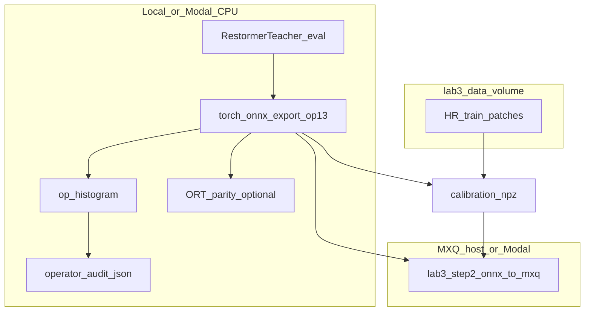

# Plan: Restormer teacher NPU compatibility notebook (revised)

## Goals (why this notebook exists)

- Produce a **repeatable evidence trail** for whether [`RestormerTeacher`](Teacher-Student%20Reformer/restormer_teacher/model.py) is a **safe compile target** for the Lab 3 toolchain (PyTorch → ONNX → MXQ → NPU), using the same evidence style as the course rubric.
- Separate three notions the rubric and MLA sheet conflate in practice:
  - **Graph coverage:** which ONNX ops appear and how often.
  - **MLA classification:** Pasuko “Yes” vs “CPU Fallback” vs documented **fail** cases ([`bence.pasuko.com_mla-supported-operations_.pdf`](bence.pasuko.com_mla-supported-operations_.pdf)).
  - **Course latency risk:** rubric “NPU Design Rules” treat many “CPU Fallback” ops as **latency hazards** even if compile succeeds ([`docs/model_notebook_requirements_rubric.md`](docs/model_notebook_requirements_rubric.md) ~153–228).

## Scope and constraints

- **No package code changes** in this step: do not edit [`restormer_teacher/model.py`](Teacher-Student%20Reformer/restormer_teacher/model.py) (or sibling modules). The notebook **documents** mitigations; implementation is a later PR.
- **Teacher vs submission:** This notebook targets the **Restormer teacher** under `Teacher-Student Reformer/`. It is **not** the primary Lab 3 submission artifact unless you later inline the model per rubric “Notebook Independence.” State that explicitly in the notebook title block so course reviewers are not confused.
- **Execution venue:** Per [`AGENTS.md`](AGENTS.md), prefer **Modal** for anything that needs GPU, large I/O, or consistent Linux+qubee-adjacent environments; keep **export + ORT parity + op audit** runnable on CPU inside Modal or locally as long as it does not violate “no local training” (this notebook does not run a training loop—it audits and exports).
- **Clean git tree:** Unrelated modified files ([`AGENTS.md`](AGENTS.md), [`lab3_wide_residual_nobn_modal_app.ipynb`](lab3_wide_residual_nobn_modal_app.ipynb)) are outside this plan; revert separately if desired.

## Technical analysis (baseline `RestormerTeacher`)

### Architecture recap (for notebook prose)

- **U-Net encoder–decoder** with skip concatenation at three scales; same-resolution output with **global residual** `out = clamp(lr + conv_head(features), 0, 1)` in [`RestormerTeacher.forward`](Teacher-Student%20Reformer/restormer_teacher/model.py).
- **Norm:** Custom **channel-wise** LayerNorm over `B,C,H,W` via `mean`/`var` over `dim=1` ([`BiasFreeLayerNorm` / `WithBiasLayerNorm`](Teacher-Student%20Reformer/restormer_teacher/model.py))—not the same as standard `nn.LayerNorm` over last dim, but ONNX still decomposes to **ReduceMean**, **Sub**, **Mul**, **Sqrt**, **Div** (empirically verified on a minimal LN-style module export).
- **MDTA:** `Conv2d` 1×1, depthwise `Conv2d` 3×3 (groups = `3*dim`), `F.normalize` (L2 on last dim), **learnable temperature** via `softplus(_log_temperature)`, `matmul` → **softmax** → `matmul` with `V`. Attention is **over the `head_dim` axis** (matmul shape `(head_dim, hw)` with `(hw, head_dim)` → `(head_dim, head_dim)` per head), **not** full spatial `O((HW)^2)`—important to state so readers do not dismiss the model as impossible at 256².
- **GDFN:** `GELU(x1) * x2` with depthwise 3×3 between pointwise expansions—GELU typically ONNX-decomposes to **Erf** + mul/add/div, matching Pasuko **Gelu → CPU Fallback**.
- **Upsample:** `Conv2d` + **`PixelShuffle(2)`** → ONNX **`DepthToSpace`**; Pasuko lists **DepthToSpace → Yes** (distinct from **SpaceToDepth**, which appears in the PDF **failed** list—do not confuse them in the notebook text).
- **Downsample:** `Conv2d` kernel 4 stride 2—standard **Convolution → Yes**.

### ONNX op inventory (empirical baseline)

A smoke `RestormerTeacher` export (`opset_version=13`, `dynamo=False`, reduced `num_blocks`, `64×64` dummy input) produced at least the following **non-Constant** ops (counts scale with block counts; notebook should regenerate on **256×256** and full architecture):

| ONNX op (representative) | Approx role in this model | MLA PDF (Pasuko) | Rubric “Avoid / latency” |
|--------------------------|---------------------------|------------------|---------------------------|
| Conv | Patch embed, MDTA QKV/project, GDFN, down/up, skips reduce, head | Convolution **Yes**; depthwise → **DepthwiseConvolution / GroupConvolution Yes** | Preferred |
| DepthToSpace | PixelShuffle upsamples | **DepthToSpace Yes** | Acceptable per rubric when needed |
| ReduceL2 | `F.normalize` in MDTA | **ReduceL2 Yes** | Rubric lists Reduce* as avoid; **conflict** between Pasuko Yes and rubric caution—notebook should explain: “Yes on NPU per sheet, still graph noise and possible fusion loss.” |
| ReduceMean, Sqrt, Sub, Div, Mul | Custom LayerNorm2d / norm paths | **ReduceMean CPU Fallback**; **Sqrt** not listed as Yes; PDF **failed** section ties **Sqrt** / **LayerNormalization** / **RmsNormalization** to quantizer **SqrtOptions** issues | Rubric **Do not introduce Sqrt** | **Highest compile/quantize risk tier** |
| MatMul, Softmax | MDTA attention | **MatMul CPU Fallback**, **Softmax CPU Fallback** | Rubric **Avoid** both |
| Softplus | Temperature | **Softplus CPU Fallback** | Rubric-style latency risk |
| Erf (+ surrounding Mul/Add/Div) | GELU decomposition | **Gelu CPU Fallback** (when not fused) | Rubric **Avoid Gelu** |
| Add | Residuals | **Adding CPU Fallback** | Rubric **Avoid Adding** |
| Concat | Skip connections | **Concatenate CPU Fallback** | Rubric **Avoid Concatenate** |
| Clip | Final `clamp(0,1)` | **Clip CPU Fallback** | Rubric **Avoid Clip** |
| Reshape, Transpose, Slice, Gather, Expand, Shape | Views / layout | Mostly **CPU Fallback** rows in PDF | Rubric lists several |

**Analysis paragraph for the notebook:** The model is **not** “NPU-pure” under Pasuko: a large fraction of nodes are **CPU Fallback**. Under the rubric, that is a **latency** problem for graded NPU runs even if compilation succeeds. The **dominant unique risk** vs a simple conv SR net is the combination of **Sqrt** (from custom norm) with the PDF’s documented failures around **SqrtOptions** / LayerNorm-class ops—this should be called out as “**verify on real qb / MXQ pipeline**; sheet alone is insufficient.”

### Conflicts between Pasuko sheet and course rubric

- **ReduceL2:** Pasuko **Yes**; rubric lumps “Reduce*” into avoid-for-latency. The notebook should **not** silently treat ReduceL2 as “bad” without noting the sheet says Yes.
- **Relu:** Pasuko marks **Relu CPU Fallback**; rubric also says avoid **Relu** for latency—so “replace GELU with ReLU” is **not** a silver bullet for MLA-100.
- **Celu / InstanceNormalization:** Pasuko **Celu Yes**, **InstanceNormalization Yes**—these are the strongest **single-op** levers discussed in prior analysis for a *future* code change; the notebook appendix cites them with the caveat that **InstanceNorm changes normalization semantics** vs Restormer’s channel LN.

## Notebook file and audience

- **Path:** [`Teacher-Student Reformer/notebooks/lab3_restormer_teacher_npu_compat_modal.ipynb`](Teacher-Student%20Reformer/notebooks/lab3_restormer_teacher_npu_compat_modal.ipynb)
- **Audience:** You (and TAs) proving export + op audit + handoff; optional input to whether a **student** network should distill from this teacher or use a different backbone.

## Cell-level structure (implementation guide)

### Section 0 — Front matter (markdown)

- Title, author, date, **non-submission** disclaimer, links to rubric + Pasuko PDF + canonical Modal notebook.

### Section 1 — Setup (code + markdown)

- `sys.path.insert(0, str(Path("..").resolve()))` or equivalent so `from restormer_teacher.model import build_teacher_model, RestormerTeacher` works when cwd is `notebooks/`.
- Print `torch.__version__`, optional `onnx` / `onnxruntime` versions; **fail with clear message** if `onnx` missing (audit section depends on it); ORT optional but recommended for parity.
- **Modal:** `import modal` (or stub), read `modal.toml` / env if repo uses it; mirror **volume name patterns** from [`lab3_wide_residual_nobn_modal_app.ipynb`](lab3_wide_residual_nobn_modal_app.ipynb) (`modal_data_volume` / `modal_runs_volume` fields around the `AppConfig` dataclass—notebook should default to **`lab3-data`** for dataset per AGENTS, and a runs volume consistent with canonical app).
- `torch.manual_seed`, `np.random.seed` for reproducible dummy tensors and calibration sampling.

### Section 2 — Data (code)

- Resolve **Lab3 root** (walk parents until `Data/HR_train` exists or accept env `LAB3_ROOT`).
- Count LR/HR pairs under `Data/LR_train` / `Data/HR_train` and val dirs per rubric §2.
- **Hard assert:** export dummy shape `N,3,256,256`; document output shape `N,3,256,256`.

### Section 3 — Model (code + markdown)

- Build architecture from **smoke profile** in [`configs/restormer_teacher.yaml`](Teacher-Student%20Reformer/configs/restormer_teacher.yaml) for fast iteration; second optional cell builds **large** profile for “production” op counts with a warning about export time.
- `model.eval()` before export.
- Optional: `torch.load(..., weights_only=True)` map into `RestormerTeacher` if `RESTORMER_TEACHER_CKPT` env set; else random weights with banner “audit is structural, not accuracy.”

### Section 4 — ONNX export + op histogram (code)

- Match canonical patterns from [`lab3_wide_residual_nobn_modal_app.ipynb`](lab3_wide_residual_nobn_modal_app.ipynb) function **`export_to_onnx`**: `torch.onnx.export(..., dynamo=False, opset_version=13, input_names, output_names)`, `onnx.checker.check_model`, record `opset_import[0].version` and file size.
- Write ONNX to `runs/<run_name>/exports/restormer_teacher.onnx` (run_name includes date slug for sync consistency).
- Build `collections.Counter` over `node.op_type` excluding or separately reporting `Constant` (Constants dominate counts but are not interesting for NPU mapping—report both **with** and **without** Constants in the notebook tables).

### Section 5 — MLA mapping + risk tiers (markdown + code)

- Code: load ONNX GraphProto, iterate nodes, aggregate counts.
- Markdown: **Tier A (compile risk):** ops in Pasuko **failed** list or same family as known breakers (**Sqrt** chain, anything that might fuse to **LayerNormalization**). **Tier B (latency):** CPU Fallback ops on hot path (MatMul, Softmax, Gelu/Erf, Softplus, ReduceMean, Add, Concat, Clip). **Tier C (likely NPU-heavy):** Conv, DepthToSpace, ReduceL2 (with rubric caveat).
- Serialize **`operator_audit.json`** next to ONNX: `{ "op_counts": {...}, "op_counts_no_constant": {...}, "opset": 13, "input_shape": [1,3,256,256], "architecture_profile": "smoke|large", "notes": "..." }`.

### Section 6 — Parity (code)

- Reuse canonical idea: **ONNXRuntime** `InferenceSession(..., providers=["CPUExecutionProvider"])`, same `dummy` tensor, compare `torch_out` vs `ort_out` with `torch.testing.assert_close` or `np.allclose` with documented **`atol`/`rtol`** (e.g. `atol=1e-5`, `rtol=1e-3` float32—tune and document).
- If ORT missing: skip with explicit “parity not run.”

### Section 7 — Calibration (code)

- Rubric: calibration must be **training-derived**. Implement: sample `K` random **HR** (or LR, consistent with your MXQ script) patches `256×256` from train files using same pairing logic as teacher training, save `np.savez` or `.npy` list under `exports/calibration/` with manifest JSON listing source basenames (no hidden test data).
- State batch size and dtype expected by `lab3_step2_onnx_to_mxq.py` if that script exists at repo root (canonical notebook references [`lab3_step2_onnx_to_mxq.py`](lab3_step2_onnx_to_mxq.py)).

### Section 8 — MXQ handoff (markdown + optional code)

- Mirror **`build_mxq_handoff`** from canonical notebook: paths to `--onnx`, calibration dir, output `.mxq`, `run_mxq_compile` flag default **False** with instructions to enable on Modal/Linux where qubee exists.
- Print final artifact paths for `.onnx`, calibration, `.mxq` placeholder per rubric §5.

### Section 9 — Modal app (code cells, optional but planned)

- Define `modal.App` and one `@app.function` that:
  - mounts **`lab3-data`** (read-only) and runs-volume (read-write),
  - copies minimal code or installs package from mounted repo,
  - runs sections 4–8 remotely,
  - writes to `/runs/<started_day>/<run_name>/exports/...`,
  - returns or syncs paths (match canonical notebook’s **day-partitioned sync** narrative).
- Document how to pull results into local `runs/` for version control (AGENTS: “sync day-partitioned Modal run outputs”).

### Section 10 — Appendix: mitigations (markdown only)

| Change (future code) | Expected ONNX impact | Pasuko hint | Tradeoff |
|----------------------|----------------------|-------------|----------|
| Replace custom LN with `nn.InstanceNorm2d(C, affine=True)` | Often single **InstanceNormalization** | **Yes** | Different normalization; may hurt Restormer-style training |
| Replace `F.gelu` with `F.celu` / `nn.CELU` | **Celu** op | **Yes** | Different activation curve |
| Remove learnable temperature (scalar 1) | Drops **Softplus** | Fewer CPU Fallback nodes | Less expressive attention scaling |
| Replace MDTA with depthwise-separable conv mixer | Removes **MatMul**/**Softmax** blocks | More **Convolution Yes** | No transposed attention; teacher capacity drops |

- Explicit **do-not** for MLA PDF: do not suggest **`torch.abs`**-based positivity tricks (**Abs** failed in sheet); avoid **SpaceToDepth** language for PixelShuffle (wrong op).

## Alignment with canonical Modal notebook

- Reuse patterns from [`lab3_wide_residual_nobn_modal_app.ipynb`](lab3_wide_residual_nobn_modal_app.ipynb): `export_to_onnx` metadata fields (`onnx_checker`, `onnx_opset`, ORT session), `build_mxq_handoff` pointing at [`lab3_step2_onnx_to_mxq.py`](lab3_step2_onnx_to_mxq.py), run directory layout under `runs/`.
- Do **not** fork a second incompatible volume naming scheme; grep the canonical notebook for `lab3-data`, `AppConfig`, and `finalize` / sync helpers if extending.

## Success criteria (acceptance)

- One-command “Run All” (local or Modal) completes without editing `restormer_teacher`.
- Artifacts: **`restormer_teacher.onnx`**, **`operator_audit.json`**, calibration bundle, printed **absolute paths**.
- Markdown contains at least one **explicit table** ONNX-op → MLA classification → tier (A/B/C) + short rationale.
- **256×256×3** asserted in code for export I/O.
- Notebook states **latency vs compile-risk** distinction and the **ReduceL2 Yes vs rubric Avoid** nuance.

## Out of scope (explicit)

- Changing `TeacherArchitectureConfig` / YAML profiles for NPU flags.
- Training the teacher in-notebook (keep using existing Modal teacher pipeline / scripts).
- Promising a passing **hardware** NPU score—only structural + toolchain evidence.

## Mermaid (artifact flow)

