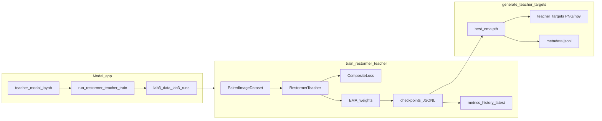

# Restormer teacher + target generation (Teacher-Student Reformer)

## Layout and path resolution

Create directory **[`Teacher-Student Reformer/`](Teacher-Student Reformer/)** as the root for this work:

| Deliverable | Path |
|-------------|------|
| Training CLI | [`Teacher-Student Reformer/scripts/train_restormer_teacher.py`](Teacher-Student Reformer/scripts/train_restormer_teacher.py) |
| Targets CLI | [`Teacher-Student Reformer/scripts/generate_teacher_targets.py`](Teacher-Student Reformer/scripts/generate_teacher_targets.py) |
| Config | [`Teacher-Student Reformer/configs/restormer_teacher.yaml`](Teacher-Student Reformer/configs/restormer_teacher.yaml) |
| Notes | [`Teacher-Student Reformer/docs/restormer_teacher_notes.md`](Teacher-Student Reformer/docs/restormer_teacher_notes.md) |
| Modal app (entrypoint) | [`Teacher-Student Reformer/tools/restormer_teacher_modal_app.py`](Teacher-Student Reformer/tools/restormer_teacher_modal_app.py) |
| Modal teacher notebook | [`Teacher-Student Reformer/notebooks/restormer_teacher_modal_app.ipynb`](Teacher-Student Reformer/notebooks/restormer_teacher_modal_app.ipynb) |

Supporting Python package (keeps the two CLIs thin and testable): **`Teacher-Student Reformer/restormer_teacher/`** with modules such as `model.py`, `data.py`, `losses.py`, `metrics.py`, `checkpointing.py`, `logging_utils.py` (names can vary; goal is separation of concerns).

**Repo root resolution**: both scripts set `PROJECT_ROOT = Path(__file__).resolve().parents[2]` (Lab3 root: `Teacher-Student Reformer/scripts` → `parents[2] == Lab3`). Resolve `--data-root` relative to cwd if not absolute; default `Data` → `PROJECT_ROOT / "Data"`. Run artifacts under `PROJECT_ROOT / "runs" / "restormer_teacher" / <run_id>` so paths match your examples (`runs/restormer_teacher/<run_id>/teacher_targets/`).

**Policy note for docs**: [AGENTS.md](AGENTS.md) expects Lab 3 training on Modal; align the **primary** teacher training path with **Modal** (notebook + app below). The **local CLI** remains for fast CPU/GPU smoke and debugging. The teacher is still **not** the NPU submission—state that clearly in `restormer_teacher_notes.md`.

---

## A. Data pipeline (`data.py` + training script wiring)

- **Pair discovery**: Mirror [tools/lab3_pipeline_lib.py](tools/lab3_pipeline_lib.py) behavior: `collect_paired_by_subfolder(LR_train, HR_train)` (HR_train* ↔ LR_train* by suffix), validation via `LR_val` + `HR_val` flat pairing by basename (`collect_paired_flat`). Optionally import these two functions from `tools/lab3_pipeline_lib` to avoid drift, while still exposing a **`PairedImageDataset`** class in this package (wrapper or thin reimplementation) as required.
- **Startup validation**: Assert existence of `Data/HR_train/HR_train{1..4}`, `Data/LR_train/LR_train{1..4}`, `Data/HR_val`, `Data/LR_val`; fail fast if missing or zero pairs.
- **Counts**: Print train and val pair counts before training.
- **I/O**: Load RGB with Pillow; **`float32` in [0,1]**; return **`CHW`** tensors (same as `pil_to_tensor` in pipeline lib).
- **Train**: Random **synchronized** crop to `patch_size` (YAML; default 192 or 224 per config comment); then **hflip, vflip, 90°×k** on both LR and HR (reuse logic pattern from `augment_pair` / `random_crop_pair` in pipeline lib).
- **Val**: No resize if images are already 256×256; if a pair is not 256×256, **fail fast with a clear error** (validation contract is full 256×256).
- **Identity baseline**: One full pass over the val loader **before epoch 1**; compute mean PSNR(LR, HR) using the same **`tensor_psnr`-compatible** formula as [tools/lab3_pipeline_lib.py#L314-L317](tools/lab3_pipeline_lib.py) (MSE over all spatial+channel dims, clamp to [0,1], `eps=1e-12`, batch mean then dataset mean). Print once.

---

## B. Restormer-style teacher (`model.py`)

Implement a **same-resolution** UNet-like encoder–decoder Restormer variant (no spatial super-resolution head):

- **Norms**: `BiasFreeLayerNorm` / `WithBiasLayerNorm` on `C×H×W` (channel-last internal), plus **`LayerNorm2d`** thin wrapper used by blocks.
- **OverlapPatchEmbed**: `Conv2d(3, dim, 3, padding=1)`.
- **MDTA**: `1×1` QKV → **depthwise `3×3`** on QKV → reshape to heads → **transposed attention** over spatial tokens (Restormer-style), with a **learnable temperature** `nn.Parameter` (positive via `softplus` or `exp` of log-temp) applied before softmax → project with `1×1`.
- **GDFN**: `1×1` expand → **DW 3×3** → **GELU gate** (channel split) → `1×1` project; hidden width from `ffn_expansion_factor` (e.g. `int(dim * 2.66)`).
- **TransformerBlock**: `norm → MDTA → norm → GDFN` with residuals.
- **Encoder / decoder**: **PixelUnshuffle / PixelShuffle** (or strided conv / convtranspose) **Downsample/Upsample** ×2 per stage; **skip concatenation** at decoder (double channels then `1×1` fuse to `dim` before blocks, matching common Restormer implementations).
- **Refinement**: `num_refinement_blocks` at full resolution after decoder.
- **Head**: `Conv2d` → **residual in image space**: `out = clamp(lr_input + residual, 0, 1)` where `lr_input` is the original LR image tensor (not the embedded feature map). Forward signature: `forward(self, lr_rgb_chw)` returns restored tensor same shape.

**YAML profiles** (single file, two named sections or `profile: large|smoke`):

| | smoke | large (teacher) |
|--|-------|-----------------|
| dim | 32 | 48 |
| num_blocks | [2,2,4,2] | [4,6,6,8] |
| num_refinement_blocks | 2 | 4 |
| heads | [1,2,4,8] | [1,2,4,8] |
| ffn_expansion_factor | 2.66 | 2.66 |

`--smoke-test` in the training CLI forces smoke architecture + **1 epoch** (and small batch if not set) for local verification.

---

## C. Training loop (`train_restormer_teacher.py` + helpers)

- **Optimizer**: AdamW (`lr`, `weight_decay` from YAML).
- **Schedule**: Cosine decay from `lr` to `min_lr` over training, with **linear warmup** for `warmup_epochs`.
- **AMP**: On CUDA, use `torch.autocast` with **`dtype=torch.bfloat16`** when `torch.cuda.is_bf16_supported()` else float16; MPS/CPU: full float32.
- **Gradient clipping**: `torch.nn.utils.clip_grad_norm_`.
- **EMA**: Separate `EMA` helper holding shadow weights; `decay` from YAML (default 0.999); update after each optimizer step.
- **Checkpoints** (under run dir, e.g. `checkpoints/`):
  - **`best_ema.pth`**: when mean val PSNR (EMA) improves.
  - **`latest.pth`**: every epoch end (model + optimizer + scheduler + epoch + best metrics + EMA).
- **Logging (run directory)** — all under `runs/restormer_teacher/<run_id>/`:
  - **`metrics.jsonl`**: append **one JSON object per epoch** (minimum): `epoch`, wall time / `elapsed_s`, `train_loss`, `train_loss_components` (charb / l1 / edge / fft), `residual_report_l1`, `lr`, `val_psnr_raw`, `val_psnr_ema`, `val_delta_raw`, `val_delta_ema`, `val_residual_ratio_raw`, `val_residual_ratio_ema`, `best_val_psnr_ema`, `global_step` optional. Optionally add **per-N steps** training lines during long epochs (same schema with `kind: "train_step"` vs `kind: "epoch"`) for “regular” granular metrics without exploding file size (e.g. every 50–200 steps, configurable in YAML).
  - **`latest_status.json`**: after each epoch, overwrite with a compact snapshot (same headline metrics + paths to `best_ema.pth`, `latest.pth`, last sample image dir).
  - **`history.json`**: **cumulative training record** for dashboards and diffing runs. Structure: top-level `meta` (`run_id`, `config_path`, `profile`, `started_at`, `data_root`, `modal_app` / `hostname` when present) and **`epochs`**: array of per-epoch dicts mirroring the epoch line in `metrics.jsonl` (losses, PSNRs, deltas, ratios, best-so-far). **Rewrite atomically** each epoch (`write temp → replace`) so partial writes never corrupt readers. On **resume**, load existing `history.json` if present and append new epochs only (validate `epoch` continuity).
- **Stdout / Modal**: use Python **`logging`** with a clear format (`%(asctime)s %(levelname)s %(message)s`) so Modal logs are readable; log epoch start/end, val summary, checkpoint paths, and any volume `commit()` calls.
- **Defaults** (YAML): epochs 100, lr `2e-4`, min_lr `1e-6`, wd `1e-4`, warmup_epochs 3, ema_decay 0.999, patch_size 192 or 224.
- **Batch size**: If config `batch_size` is `auto` or missing, pick **4 vs 8** from `torch.cuda.get_device_properties(0).total_memory` (threshold ~16GiB: ≤16 → 4, else 8); document override in YAML.

---

## D. Losses (`losses.py`)

- **Charbonnier**: `sqrt((x-y)^2 + eps^2)` mean.
- **L1**.
- **Edge**: L1 on first differences along x and y on luminance or RGB (document choice; default: mean of `|Δx|+|Δy|` on all channels).
- **FFT HF**: L1 on magnitude of `torch.fft.rfft2` (real 2D FFT) of pred vs HR (per-channel or grayscale—pick one and document).

**Training loss** (exact weights):

`0.50 * Charb + 0.25 * L1 + 0.15 * Edge + 0.10 * FFT`

**Reporting only**: `L1(pred - lr, hr - lr)` (scalar logged each epoch).

---

## E. Validation (each epoch)

- Run **raw model** and **EMA model** on full val set (no AMP for eval or autocast consistent with train—prefer full float32 eval for stable PSNR).
- Report: **identity PSNR** (fixed from pre-train), **model PSNR**, **delta = model − identity**, **residual magnitude ratio** (define as e.g. `mean(||pred−lr||_1) / (mean(||hr−lr||_1)+ε)` aggregated over val), **best PSNR so far** (EMA track).
- **Samples**: Save a small fixed set (e.g. first K val pairs) each epoch: LR, HR, pred (EMA), **amplified residual** `(pred−lr)*scale` saved as heatmap-friendly PNG (clip for display).
- **No aggressive early stopping** (train full `epochs`).

---

## F. `generate_teacher_targets.py`

- Load **`best_ema.pth`** (path via `--checkpoint`).
- Iterate **all training pairs** (same pairing as training).
- For each image: run teacher at **full 256×256**; save **`teacher_pred`** as **PNG** (and optionally **`.npy`** float32 CHW under a `npy/` subfolder).
- Append one **JSONL** line per image with: `basename`, `lr_path`, `hr_path`, `teacher_out_path`, `identity_psnr`, `teacher_psnr`, `teacher_delta_psnr`, `use_for_distillation` (bool: `teacher_psnr > identity_psnr`).
- **`--save-residuals`**: also save `teacher_pred - lr` (PNG amplified or `.npy`).
- **`--only-save-improved`**: when set, **skip writing** pred/residual files if not improved; still append JSONL for audit (recommended) so you have a full index—document this behavior in `--help` and notes.

---

## G. `docs/restormer_teacher_notes.md`

Short doc covering: teacher is **not** NPU submission; purpose (soft + residual targets); recommended student inputs (HR, teacher pred, teacher residual); suggested student loss (your formula); **only trust targets where teacher beats identity**; how to run **local** train/target CLIs vs **Modal** (`restormer_teacher_modal_app.ipynb` + volume sync); where artifacts land (`metrics.jsonl`, `history.json`, `latest_status.json`, checkpoints).

---

## H. CLI summary

**`train_restormer_teacher.py`**: `--config` (default to package `configs/restormer_teacher.yaml`), `--data-root`, `--run-name`, `--smoke-test`, `--resume`.

**`generate_teacher_targets.py`**: `--checkpoint`, `--data-root`, `--output-dir`, `--only-save-improved`, `--save-residuals`.

---

## I. Modal notebook + Modal app (primary remote training)

Mirror the proven pattern in [`tools/lab3_modal_app.py`](tools/lab3_modal_app.py): separate **Modal App** Python module + **notebook** that configures and launches it (same mental model as [`lab3_wide_residual_nobn_modal_app.ipynb`](lab3_wide_residual_nobn_modal_app.ipynb)).

### Modal app (`Teacher-Student Reformer/tools/restormer_teacher_modal_app.py`)

- **New Modal `App` name** (distinct from `lab3-modal-pipeline`), e.g. `restormer-teacher`, with a named **`@app.function`** e.g. `run_restormer_teacher_train`.
- **`modal.Image`**: Debian slim + PyTorch + `pillow`, `pyyaml`, `numpy` (pin versions consistently with Lab3 Modal image where sensible). **`add_local_dir`** the entire **`Teacher-Student Reformer/`** tree (or minimal set: `restormer_teacher/` package + `scripts/` + `configs/`) into a fixed **`REMOTE_PROJECT_ROOT`** (e.g. `/root/restormer_teacher_project`), plus **`add_local_dir`** repo **`tools/`** only if you keep importing `collect_*` / `tensor_psnr` from `lab3_pipeline_lib` (otherwise self-contained package only).
- **Volumes** (same as Lab 3): mount **`lab3-data`** at `/mnt/lab3-data` and **`lab3-runs`** at `/mnt/lab3-runs`; set remote **`data_root`** to `/mnt/lab3-data/Data` and **`artifact_root` / run root** under `/mnt/lab3-runs/runs/restormer_teacher/<run_id>` (or `/mnt/lab3-runs/...` matching local `runs/` layout so **`modal volume get`** sync works like `sync_run_from_volume` in lab3_modal_app).
- **Remote function body**: `sys.path` insert → import a **single entry function** from `restormer_teacher.train` (or subprocess `python -m ...`) that runs the full training loop with paths pointing at volume mounts; **`runs_volume.commit()`** after training (and optionally periodic commits if implementing mid-run checkpoints—at minimum end-of-run).
- **Optional helper**: `execute_restormer_teacher_modal(...)` that wraps data sync (`modal volume put` to `lab3-data` when needed), builds remote payload (YAML path, run_name, profile, gpu, timeout), **spawn + heartbeat polling** (reuse the timeout/heartbeat pattern from `execute_modal_pipeline`), then **`modal volume get`** to pull `runs/<day>/<run_name>/` into local `Lab3/runs/...` for inspection.

### Notebook (`Teacher-Student Reformer/notebooks/restormer_teacher_modal_app.ipynb`)

Structured sections (rubric-friendly clarity, even though this notebook is not the NPU submission):

1. **Title / scope** — teacher only; 256×256 same-res I/O; not MXQ.
2. **Setup** — `modal` CLI auth note; env vars: `LAB3_MODAL_GPU`, `LAB3_NOTEBOOK_MODAL_DATA_VOLUME`, `LAB3_NOTEBOOK_MODAL_RUNS_VOLUME`, timeout, `run_name`, profile (`smoke` / `large`).
3. **Config** — load YAML from `Teacher-Student Reformer/configs/restormer_teacher.yaml`; display resolved hyperparameters.
4. **Launch** — `modal run` / `app.run()` pattern calling into `restormer_teacher_modal_app` (either `%run` the `.py` module or import `execute_restormer_teacher_modal` if exposed).
5. **Artifacts** — where **`metrics.jsonl`**, **`history.json`**, **`latest_status.json`**, checkpoints, and val samples land after sync; how to open `history.json` for curves.

### Logging contract (Modal + local)

- **Files on runs volume** (authoritative): `metrics.jsonl` (regular epoch lines + optional step lines), `history.json` (full epoch array + `meta`), `latest_status.json`, `run_config.json` (copy/snapshot of resolved training config at run start).
- **Modal dashboard**: rely on structured **stdout** from the training entrypoint; avoid printing huge tensors.
- After sync to laptop, optional **path normalization** (like `normalize_synced_run` in lab3_modal_app) can rewrite absolute `/mnt/...` strings inside JSON to local paths—only if the teacher run JSON references those paths; document in teacher notes.

---

## J. Quality checks (implementation completion)

From repo root (or documented cwd):

1. Run **`python "Teacher-Student Reformer/scripts/train_restormer_teacher.py" --smoke-test --data-root Data`** (1 epoch, smoke dims); confirm no shape errors, **val tensors [B,3,256,256]**, outputs in **[0,1]**.
2. Assert **PSNR** matches a manual numpy check on one tensor pair (same as pipeline lib).
3. **Resume**: train 1 epoch, resume for 1 more, verify epoch counter and loss continuity.
4. Run **target generation** on 2–3 pairs (temporary flag or tiny `--max-images` for dev optional) verifying PNG + JSONL + optional residuals.
5. **Modal smoke**: deploy/run Modal function with **smoke profile** and short timeout; confirm remote run writes **`history.json`** with monotonic `epochs`, **`metrics.jsonl`** lines per epoch, and **`latest_status.json`**; pull volume and verify local tree.

