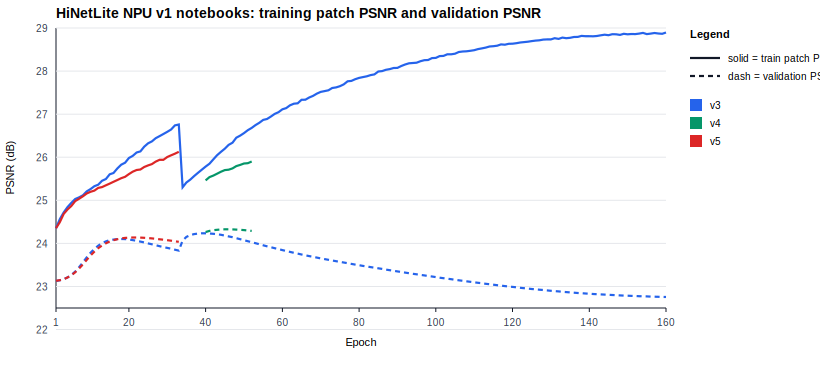

# HiNetLite NPU v1 Notebook Architecture and Performance Summary

Generated from:

- `experiments/HiNetLite NPU v1/lab3_hinet_lite_npu_v1_colab_v3.ipynb`
- `experiments/HiNetLite NPU v1/lab3_hinet_lite_npu_v1_colab_v4.ipynb`
- `experiments/HiNetLite NPU v1/lab3_hinet_lite_npu_v1_colab_v5.ipynb`

## Executive Summary

The v3 and v4 notebooks use the same primary model architecture: a mixed-kernel residual U-Net with base width `48`, two downsampling stages, two transposed-convolution upsampling stages, 18 residual blocks, and a global residual output over the LR input. v4 primarily changes the training path by polishing/resuming the v3 model, and it improves best validation PSNR from `24.2339` dB to `24.3264` dB, a gain of `0.0925` dB.

The v5 notebook compresses the architecture to base width `44` and removes one bottleneck residual block. This reduces parameters from `10,453,443` to `7,421,043`, a `29.0%` reduction, but best validation PSNR drops to `24.1359` dB.

## Architecture and Performance Table

| Notebook | Base channels | Bottleneck blocks | Total residual blocks | Parameters | Best val PSNR | Best epoch | Latest plotted val PSNR |
| --- | ---: | ---: | ---: | ---: | ---: | ---: | ---: |
| v3 | 48 | 6 | 18 | 10,453,443 | 24.2339 | 39 | 22.7555 |
| v4 | 48 | 6 | 18 | 10,453,443 | 24.3264 | 46 | 24.2909 |
| v5 | 44 | 5 | 17 | 7,421,043 | 24.1359 | 21 | 24.0372 |

## PSNR Curve

The chart uses `train_patch_psnr` for training PSNR and `val_psnr` for validation PSNR. For v4, the plotted segment is the current stage-2 polish segment after the resumed epoch sequence reset.



## Model Architecture

### What `MixedKernelUNetResidualSR` Means

`MixedKernelUNetResidualSR` is a compact super-resolution CNN built around a residual U-Net shape. It takes a `3x256x256` low-resolution RGB image tensor and predicts a same-size RGB correction image, then adds that correction back to the input. In other words, the network learns `delta = HR - LR` instead of directly generating the whole target image from scratch.

The name describes the main design choices:

- `MixedKernel`: residual blocks alternate `3x3` and `5x5` convolutions. The `3x3` layers keep the model cheaper, while the `5x5` layers give selected blocks a wider local receptive field.
- `UNet`: the model has an encoder-decoder layout with skip connections. It processes features at full resolution, downsamples twice to work on wider lower-resolution feature maps, then upsamples twice and combines decoder features with earlier encoder features.
- `Residual`: each internal block adds its learned update back to its input, scaled by `0.2`. The full model also adds the final predicted correction back to the original LR input.
- `SR`: the model is for image super-resolution/restoration under the Lab 3 `256x256x3` input/output contract.

At a high level, the active v3/v4 forward path is:

```text
input RGB
  -> stem 3x3 conv + LeakyReLU
  -> enc1 residual blocks at 48 channels
  -> down1 stride-2 conv to 96 channels
  -> enc2 residual blocks at 96 channels
  -> down2 stride-2 conv to 192 channels
  -> bottleneck residual blocks at 192 channels
  -> up1 transposed conv to 96 channels
  -> add encoder-2 skip
  -> dec1 residual blocks
  -> up2 transposed conv to 48 channels
  -> add encoder-1 skip
  -> dec2 residual blocks
  -> tail 3x3 conv to 3 channels
  -> add original input
  -> output RGB
```

The v5 class, `MixedKernelUNetResidualV5SR`, is the same architectural family with a narrower base width and one fewer bottleneck block.

### v3 - `lab3_hinet_lite_npu_v1_colab_v3.ipynb`

- Primary model: `MixedKernelUNetResidualSR`.
- Configuration: `channels=48`, `encoder_blocks=(3, 3)`, `bottleneck_blocks=6`, `decoder_blocks=(3, 3)`, `kernel_pattern=(3, 5, 3, 5, 3, 5)`, `residual_scale=0.2`, `global_residual=True`.
- Topology: `input -> stem -> enc1 -> down1 -> enc2 -> down2 -> bottleneck -> up1 + enc2 -> dec1 -> up2 + enc1 -> dec2 -> tail -> input + delta`.
- Residual blocks use two same-channel convolutions with mixed `3x3`/`5x5` kernels and LeakyReLU.
- The notebook still contains legacy model classes with half-instance normalization, but the run output confirms the active model is the mixed-kernel U-Net.
- Parameter count: `10,453,443`.
- Performance seen: best validation PSNR `24.2339` dB at epoch `39`. The current history continued to epoch `160`, where validation PSNR had fallen to `22.7555` dB while training patch PSNR reached `28.8956` dB.
- Export audit in the notebook reports `graph_op_count=122` and `blocked_ops_found=['Mul']`.

### v4 - `lab3_hinet_lite_npu_v1_colab_v4.ipynb`

- Primary model: `MixedKernelUNetResidualSR`.
- Architecture is effectively unchanged from v3: same width, block counts, kernel pattern, residual scale, skip-add U-Net layout, and parameter count.
- The notebook is cleaner architecturally than v3: it presents one clear model path instead of keeping the legacy normalization-based classes in the active architecture cell.
- Parameter count: `10,453,443`.
- Performance seen: best validation PSNR `24.3264` dB at epoch `46`, up `0.0925` dB from v3. The plotted stage-2 segment ends at epoch `52` with validation PSNR `24.2909` dB.
- Export audit in the notebook reports a smaller graph than v3 after export cleanup and scale handling.

### v5 - `lab3_hinet_lite_npu_v1_colab_v5.ipynb`

- Primary model: `MixedKernelUNetResidualV5SR`.
- Configuration: `channels=44`, `encoder_blocks=(3, 3)`, `bottleneck_blocks=5`, `decoder_blocks=(3, 3)`, `kernel_pattern=(3, 5, 3, 5, 3, 5)`, `residual_scale=0.2`, `global_residual=True`.
- Topology remains the same mixed-kernel residual U-Net, but width and depth are reduced.
- Parameter count: `7,421,043`, down `29.0%` from v3/v4.
- Performance seen: best validation PSNR `24.1359` dB at epoch `21`, down `0.1905` dB from v4. Training stopped at epoch `33` with validation PSNR `24.0372` dB.
- v5 adds residual-scale folding support for export. That change is export-facing; the training-time architecture still uses `x + residual_scale * residual`.

## Subsequent Changes

### v3 to v4

- No meaningful capacity change: both use `48` base channels, `6` bottleneck blocks, 18 residual blocks, and `10,453,443` parameters.
- v4 turns the v3 model into a polish/resume notebook. It starts from the v3 best checkpoint and trains a shorter stage-2 segment.
- The performance improvement is therefore best interpreted as a training continuation/polish effect rather than a new architecture effect.
- v4 removes ambiguity from the notebook narrative by focusing on the mixed-kernel U-Net path.

### v4 to v5

- Base width changes from `48` to `44`.
- Bottleneck depth changes from `6` blocks to `5` blocks.
- Total residual blocks drop from `18` to `17`.
- Parameters drop by `3,032,400`.
- Removing one bottleneck block also changes the decoder kernel phase. v4 uses decoder kernel sequences `dec1=[3, 5, 3]`, `dec2=[5, 3, 5]`; v5 uses `dec1=[5, 3, 5]`, `dec2=[3, 5, 3]`.
- The observed tradeoff is lower capacity and likely better latency potential, but lower validation PSNR.

## Notes

- All three notebooks keep the Lab 3 `256x256x3` model input/output contract.
- The validation input PSNR reported across these runs is about `23.1230` dB, so all three models improve over raw LR input at their best checkpoints.
- None of the observed validation PSNR values exceed the rubric's `25 dB` target. Among these three notebooks, v4 is the strongest PSNR checkpoint.
